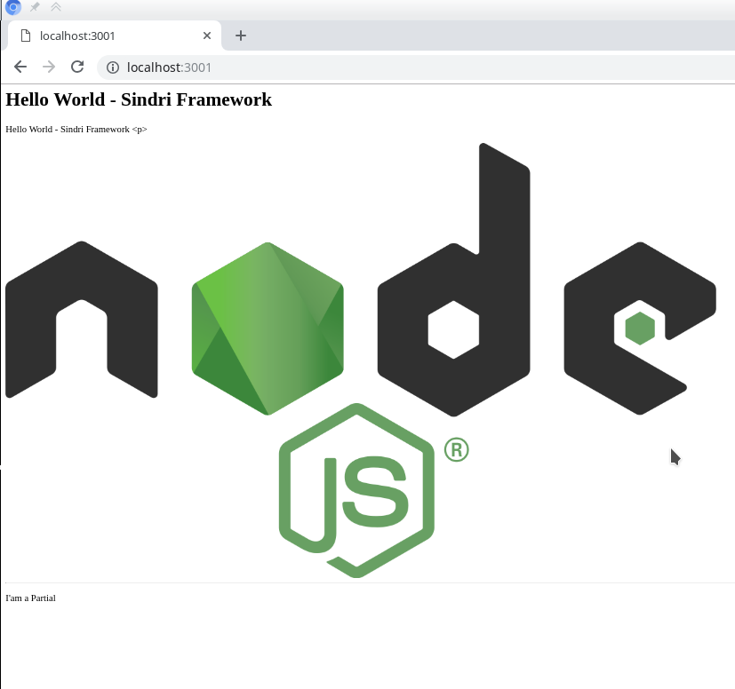

# Projeto Node Framework

Framework minimalista para nodejs com objetivo de disponibilizar uma base de código pronta para o rápido inicio de
projeto e codificação, utilizando tecnologias já disponíveis.

## Instalação

Para facilitar execução de tarefas repetitivas temos uma ferramenta de linha de comando chamada ncli, que pode ser
chamada pelo comando agtm

Instale com o seguinte comando:

```bash
$ npm i -g @agtm/ncli
```

Podemos criar um novo projeto à partir de um template já configurado usando o comando:

```bash
$ ncli-create
```

Responda as perguntas conforme abaixo:

```bash
? Nome do projeto? <Nome do projeto, por padrão o nome da pasta, não pode conter caracteres especiais>
? Descrição do projeto: <Descrição Simples>
? Seu nome: <Seu nome e sobrenome, será usado ao configurar o projeto com npm>
? Informe um e-mail válido 
? Você precisa criar pelo menos um app para este projeto.

```

Pronto, este script irá:

* Inicializa um projeto npm novo (npm init)
* Criar a estrutura básica de arquivos e diretórios com
  * Configuração lint para qualidade de código
  * Define dependencias produção de desenvolvimento, por exemplo @agtm/node-framework
  * Testes configurado e pronto pra uso
  * Script para automatizar tarefas reletivas
  * Códigos de exemplo para facilitar inicio

Carregue assets (como imagens) no diretório public:  

```bash
$ npm run install-assets
```

e execute a aplicação com:

```bash
$ npm run dev
```

Agora, no seu navegador acesso a url:

http://localhost:3001

Você deverá ver algo como isto


## Entendendo o Framework

[Clique aqui para entender como o framework funciona](./docs/entendendo_o_node_framework.md)

## Objetivos e Funcionalidades

Os principais objetivos deste projeto são:

* Exclusivo para Backend(nodejs)
* Utilização do framework ExpressJs
* Padrão ES6 com suporte ESM ou mais novo
* Suporte a jobs simples (Agendamento e execução continua) 
* Suporte a socket com socket.io

Suporte Integrado à

* Apps - Possibilidade de importar outros modulos desenvolvido no Framework, como por exemplo um painel
  administrativo completo ou um simples gerenciador de erros. Apps funcionam como plugins que podem ser facilmente
  integrados ao framework.
* [Não funcional] Compilação binária (Intergração com o pacote [pkg](https://www.npmjs.com/package/pkg) )
* Log Robusto (Integração com [Winstonjs](https://github.com/winstonjs/winston) e [GrayLog](https://www.graylog.org/) )
* Gestão de configuração    

Outras funcionalidades podem ser facilmente implementada através de apps.

## Agendamento

Baseado no modulo:
https://www.npmjs.com/package/node-cron

```javascript
export default class HelloWorldController extends Controller {

  setup() {
    this.schedule('* * * * *', () => {
      console.log('Tarefa recorrente')
    })
  }
}

```

## Gerando Versão

```bash  
  git commit  
  npm run publis-[major|minor|patch]  
```

## Guia de Estilo

Disponibiliza um guia de estilo para melhorar qualidade e padronização de codificação:

[Clique Aqui](./docs/guia_de_estilo.md)

### Versões Nodejs:
[NÃO FUNCIONAL]
Um dos objetivos do framework é a possibilidade de criar versões comerciais (binario) com a ferramenta pkg.

A ferramenta PKG utiliza uma versão própria do nodejs para gerar o binário e infelizmente nem sempre a ultima versão
disponível pelo PKG é a ultima versão disponível do nodejs.

Então, caso pretenta criar binários do seu projeto, para evitar incompatibilidades, recomenda-se utilizar no
desenvolvimento a mesma versão disponível pelo pkg.

Abaixo segue a ultima versão do nodejs em que o Node Framework foi desenvolvido e que também está disponível
para geração de binário com PKG:

Versão do Framework (Apenas major e minor) seguido da versão do NODEJS

* node-framework@2.0 - Node@10.4.1 LTS
* node-framework@2.1 - Node@12.2.0 LTS - pkg@4.3.4

**IMPORTANTE:** Sempre que atualizar o Node Framework, verificar ultimas versões e atualizar aqui. Mantenha o
histórico e sempre atualize a versão minor do Node Framework.

**DICA:** Verifique as versões do nodejs instaladas para o node-pkg aqui: /home/andre/.pkg-cache/

## Arquitetura

[Clique aqui para entender mais a fundo a arquitetura do framework](./docs/arquitetura.md)

## Guia de Desenvolvimento

Guia para desenvolvedores do Node Framework:

[Guia de Desenvolvimento](./docs/guia_de_desenvolvimento.md)
